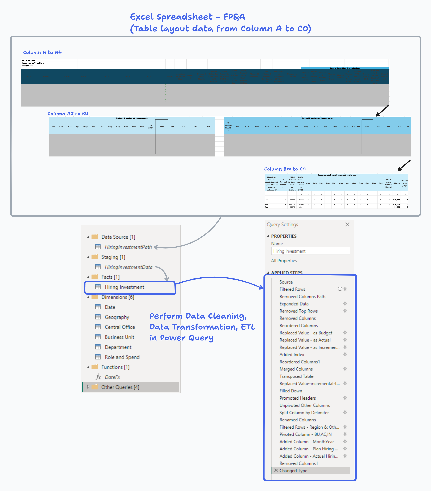
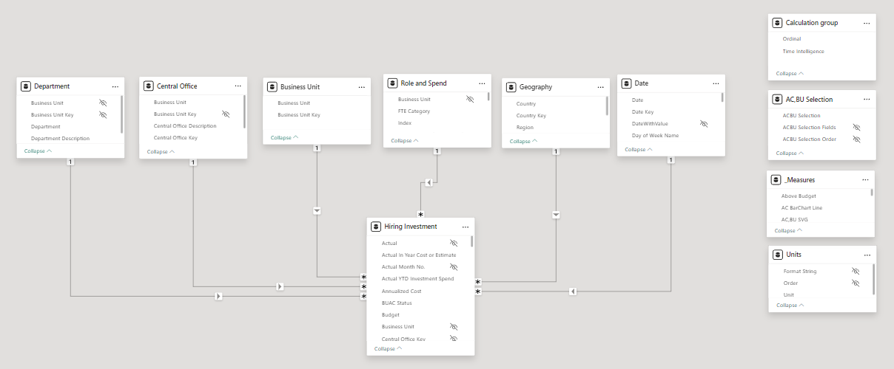
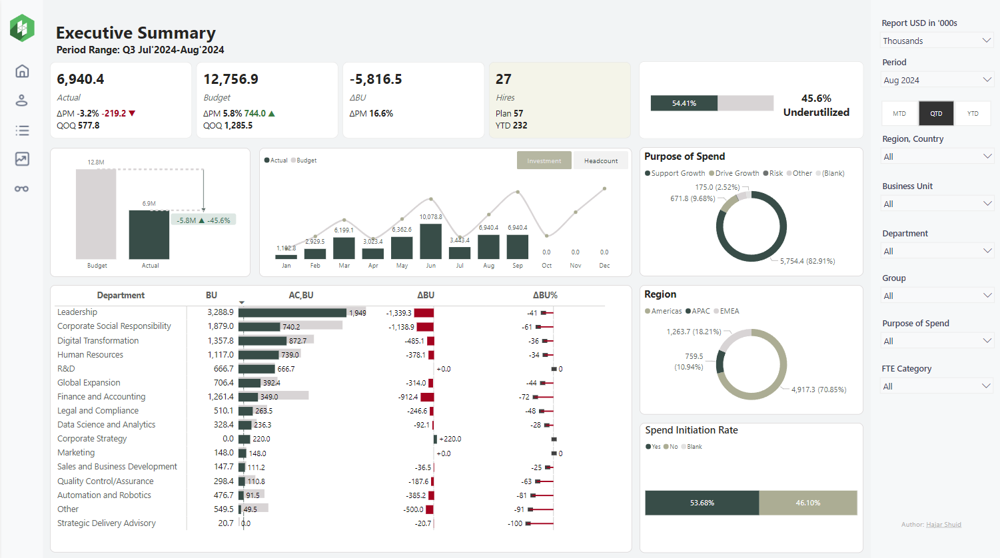
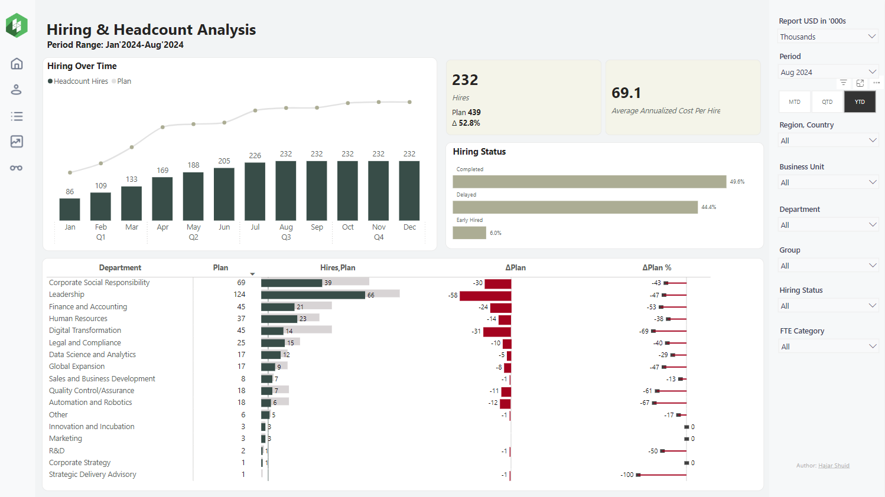
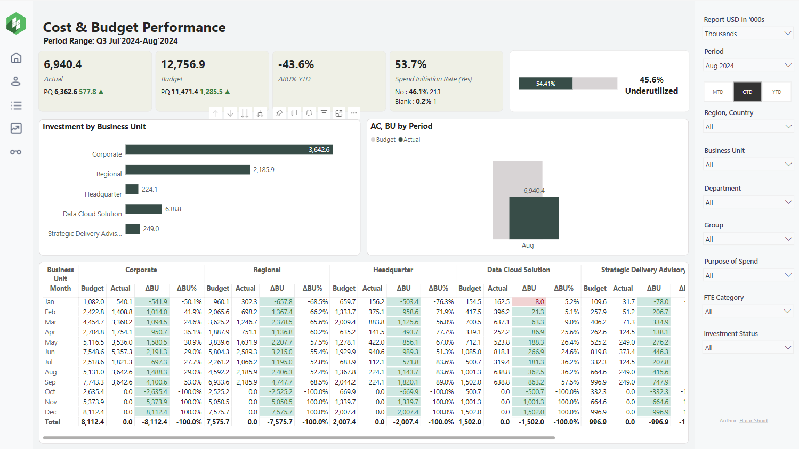
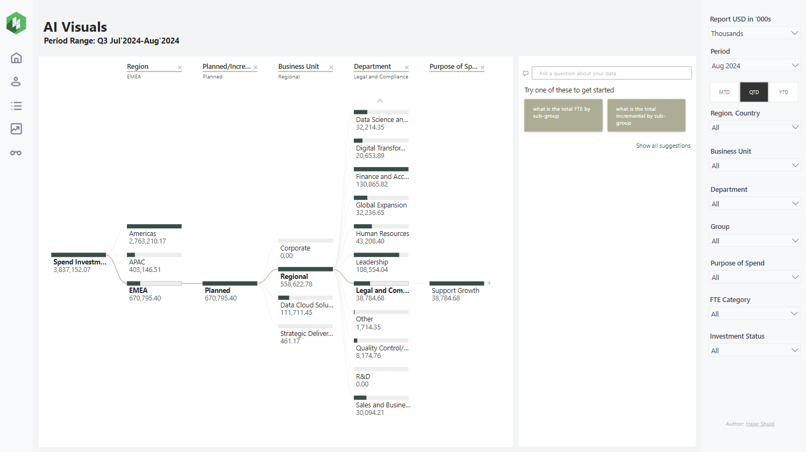

# Hiring Investment Performance Analysis

## Table of Contents
- [Hiring Investment Performance Analysis](#hiring-investment-performance-analysis)
  - [Table of Contents](#table-of-contents)
  - [Project Overview](#project-overview)
  - [Problem Statement](#problem-statement)
  - [Features](#features)
  - [Data Sources](#data-sources)
  - [Techniques Used](#techniques-used)
  - [Report Visualization](#report-visualization)
  - [Key Insights](#key-insights)
  - [DAX Measures](#dax-measures)
  - [Future Improvements](#future-improvements)
  - [Data Quality Management](#data-quality-management)

## Project Overview

The Hiring Investment Performance Analysis report is a comprehensive Power BI solution designed to provide insights into HoloSphere Tech financial performance, hiring trends, budget allocation and utilization. It was developed to address challenges in aligning hiring and budget execution with strategic plans for 2024. This dashboard enables FP&A teams and executives to make data-driven decisions, optimize hiring strategies, and align workforce planning with financial goals.

## Problem Statement

HoloSphere Tech is facing challenges in optimizing its investment strategy, particularly in hiring and resource allocation across different departments and regions. There's a significant discrepancy between budgeted and actual spending, as well as delays in hiring, which is impacting the overall financial performance and operational efficiency. The organization needs to analyze its current investment patterns, hiring efficiency, and budget utilization to improve decision-making and achieve better alignment with strategic goals.


## Features

- Executive Summary with key performance indicators
- Detailed Hiring & Headcount Analysis
- Cost & Budget Performance breakdown
- AI-powered visual analytics
- Interactive filters for time periods and departments
- Drill-through capabilities for deeper insights
- Report Line amount can change either as in Full Amount, Thousand or Millions
- Data can view by MTD/QTD/YTD selection

## Data Sources
The Power BI report is powered by data from Excel spreadsheet in FP&A SharePoint, updated quarterly with potential monthly reviews. 

(Note: All data used in this project is anonymized and for demonstration purposes only.)


## Techniques Used
1. Advanced DAX measures for complex calculations, custom visuals
2. Data modeling with star schema
3. ETL processes using Power Query (challenging table structure designed)
4. Automate data refresh with Power Automate
5. Custom visuals for enhanced data presentation
6. Parameterized reports for user flexibility
7. Row-level security (RLS) implementation by Business Unit/Department/Region for data privacy
8. AI integration

<br/>

**Challenging Table Structure**


**Star Schema**



## Report Visualization

[Interactive Report](https://app.powerbi.com/view?r=eyJrIjoiOTEzNWY5OGEtNmI1OC00MzM0LWI2OTktNGE3NTlmYWVhNmRkIiwidCI6ImFlYmMzMTg4LWU3MzYtNGRlYi05MzJiLWRjNDU5OGMwNDQ3ZCIsImMiOjN9)

_**Report Line in Thousands of USD**_










## Key Insights

**Budget Underutilization:**
* The actual spending ($6.94M) is significantly lower than the budgeted amount ($12.8M), representing a -45.6% variance.
* This underutilization suggests potential issues in project execution, delayed hiring, or overly optimistic budgeting.


**Hiring Challenges:**
* Only 232 hires have been made against a plan of 439, indicating a 52.8% shortfall in hiring targets.
* 44.4% of hiring is delayed, which could be impacting project timelines and operational capacity.
* The average annualized cost per hire is $69.1K, which should be analyzed for competitiveness and budget alignment.

**Departmental Variances:**
* Leadership and Corporate Social Responsibility departments show the largest absolute budget variances, indicating potential areas for closer scrutiny.
* R&D and Marketing departments are on target, suggesting effective budget management in these areas.

**Regional Investment Distribution:**
* The Americas region receives the largest investment (70.65%), followed by EMEA (18.21%) and APAC (10.94%).
* This distribution should be evaluated against strategic growth plans and market opportunities.

**Purpose of Spend:**
* 82.91% of spending is allocated to "Support Growth," indicating a strong focus on expansion.
* Only 9.68% is dedicated to "Drive Growth," which might need reassessment for long-term strategy.

**Business Unit Performance:**
* Corporate and Regional units show the highest investment levels, but also the largest budget variances.
* Data Cloud Solution and Strategic Delivery Advisory units demonstrate better budget adherence.

**Spend Initiation Rate:**
* The spend initiation rate of 53.7% (Yes) vs. 46.1% (No) suggests room for improvement in project kickoffs and resource utilization.

**Headcount Details:**
* Several roles, especially in Digital Transformation and Leadership, show significant delays or are unfilled, potentially impacting strategic initiatives.

**Cost Trend:**
* The actual costs have consistently been below budget across all months, indicating a systematic issue in budget planning or execution.

**AI Visuals Insight:**
* The EMEA region, despite having a lower overall investment compared to the Americas, has the highest planned investment in the Legal and Compliance department, suggesting potential regulatory or expansion focus in this region.

## DAX Measures

Here are some key DAX measures used in the dashboard.

Refer other DAX measures at [here](scripts/dax-measures.csv).

```dax
Actual =
SUMX(
    'Hiring Investment',
    'Hiring Investment'[Actual])

Budget =
SUMX(
    'Hiring Investment',
    'Hiring Investment'[Budget])

Delta ΔBU =
[Actual AC] - [Budget BU]

Delta ΔBU% =
DIVIDE(
    [Delta ΔBU], [Budget BU], 0)

Actual Previous Month (PM) =
CALCULATE(
        [Actual],
        CALCULATETABLE(
            DATEADD( 'Date'[Date], -1, MONTH ),
            'Date'[DateWithValue] = TRUE
        )
    )

Budget Previous Month (PM) =
CALCULATE(
        [Budget],
        CALCULATETABLE(
            DATEADD( 'Date'[Date], -1, MONTH ),
            'Date'[DateWithValue] = TRUE
        )
    )

MTD = 
CALCULATE ( 
        [Actual], 
        DATESMTD ( 'Date'[Date] ) )

QTD = 
CALCULATE ( 
        [Actual], 
        DATESQTD ( 'Date'[Date] ) )

Headcount Plan =
CALCULATE(
    DISTINCTCOUNT('Role and Spend'[Index]),
    FILTER(
        'Hiring Investment',
        'Hiring Investment'[Month Hiring Plan] IN VALUES('Date'[Date])
    )
)


Headcount Hired =
CALCULATE(
    DISTINCTCOUNT('Role and Spend'[Index]),
    FILTER(
        'Hiring Investment',
        'Hiring Investment'[Month Hiring Actual] IN VALUES('Date'[Date]) &&
        'Hiring Investment'[Actual YTD Investment Spend] > 0
    )
)

Delta ΔHC%
DIVIDE(
    [Headcount Hires], [Headcount Plan], 0)

Headcount Hiring Prev Month (PM) =
CALCULATE (
    [Headcount Hires],
    CALCULATETABLE ( DATEADD ( 'Date'[Date], -1, MONTH ) )
)

Headcount Plan Prev Month (PM) =
CALCULATE (
    [Headcount Plan],
    CALCULATETABLE ( DATEADD ( 'Date'[Date], -1, MONTH ) )
)

```
## Future Improvements
- Restructure badly/challenging designed tables data to improve the way data is presenting
- Implement advanced predictive analytics for hiring trends
- Add more interactive elements to the dashboard
- Integration with real-time data sources
- Automated alerts for significant budget variances

## Data Quality Management

In the process of developing and maintaining this Financial Analytics Dashboard, we encountered and addressed several data quality issues. This document outlines our approach to ensuring data integrity and the specific challenges we faced. See [Data Quality Management](data-quality-management.md).


